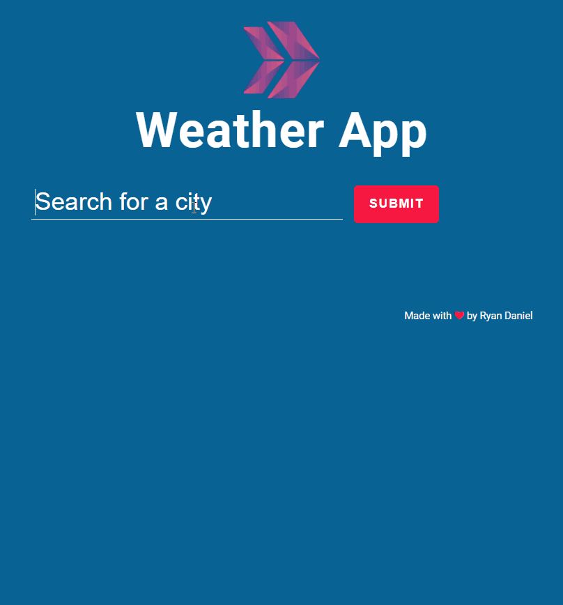

## Description
Project aims to display current weather data of searched city around the world with fetching Weather Api data.

##Link

Please visit my project page via --> https://ersenozturk.github.io/Javascript-Exercises/weather-app/

   
## Statement

- Design a weather condition page following the design and populate data for searched city with using of axios in JS.

User story;

  - User can search city around the world.
  - The app can fetch api with the searched city name(... and apikey if it is obligatory).
  - User can display weather data of searched city in weather card.
  - User can display list of searched city weather data card like on gif.
  - If new searched city is in the weather data list, app can display a warning text to user on page.

🔥 I used [OpenWeather Api](https://openweathermap.org/) for my app. 

